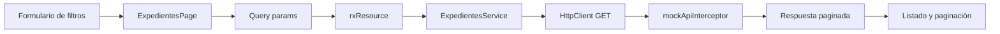

# 📁 Gestor de expedientes

Proyecto didáctico para aprender Angular 22 con una aplicación sencilla de gestión de expedientes. La app permite iniciar sesión, consultar un listado, aplicar filtros, navegar al detalle de un expediente y ver cómo se conectan componentes, rutas, servicios HTTP e interceptores.

📚 Recursos oficiales:

- [Angular](https://angular.dev/)
- [Inyección de dependencias en Angular](https://angular.dev/essentials/dependency-injection)
- [RxJS](https://rxjs.dev/guide/overview)
- [TypeScript](https://www.typescriptlang.org/)
- [TypeScript Handbook](https://www.typescriptlang.org/docs/handbook/intro.html)

## 🔎 Qué hace esta aplicación

La aplicación incluye:

- pantalla de login con validación de usuario y contraseña mediante Signal Forms
- layout común con header y footer
- listado de expedientes con número, título, estado, prioridad y fecha de alta
- filtros por número, estado, prioridad y rango de fechas
- carga del listado mediante un servicio HTTP
- interceptor que simula una API de expedientes sin backend real
- estado de carga mientras se resuelve la consulta del listado
- consulta de los datos de cada expediente
- edición de título, estado, prioridad y fecha de alta
- validación mediante Signal Forms de título y fecha de alta antes de guardar
- guardado de los cambios de edición en la API mock
- paginación visual simple en el listado
- página 404 para rutas no existentes
- routing con lazy loading para la feature de expedientes

## ▶️ Cómo arrancar el proyecto

Desde la raíz del proyecto:

```bash
npm install
npm start
```

La aplicación queda disponible normalmente en:

```text
http://localhost:4200/
```

En Windows PowerShell puede aparecer un bloqueo de ejecución de scripts con `npm.ps1`. En ese caso usa `npm.cmd`:

```powershell
npm.cmd install
npm.cmd start
```

## 🛠️ Comandos habituales de Angular

```bash
npm run build
npm test
ng serve
ng build
ng test
```

Para generar elementos con Angular CLI:

```bash
ng generate component nombre-componente
ng generate service nombre-servicio
```

## 🏗️ Arquitectura del proyecto

La estructura está organizada por responsabilidades:

- `src/app/` contiene la configuración principal de la aplicación.
- `src/app/app.config.ts` y `src/app/app.routes.ts` contienen la configuración global de proveedores y rutas.
- `src/app/core/` contiene piezas comunes como header, footer, página 404 e interceptores.
- `src/app/core/interceptors/` contiene el interceptor mock de API.
- `src/app/features/login/` contiene la feature de login.
- `src/app/features/login/components/` contiene el componente de login.
- `src/app/features/expedientes/` contiene la feature de expedientes.
- `src/app/features/expedientes/expedientes.routes.ts` define las rutas de listado, consulta y edición de expedientes.
- `src/app/features/expedientes/components/` contiene componentes reutilizables de la feature.
- `src/app/features/expedientes/pages/` contiene las páginas de listado y detalle; `expediente-detalle-page` presenta los modos de consulta y edición.
- `src/app/features/expedientes/services/` contiene el acceso HTTP para consultar y actualizar expedientes.
- `src/app/features/expedientes/models/` contiene los tipos del dominio y `ExpedienteForm`, el modelo usado por Signal Forms durante la edición.
- `src/app/features/expedientes/data/` contiene el dataset mock compartido por el interceptor y la consulta de detalle.
- `src/app/shared/` contiene elementos compartidos entre features.
- `src/app/shared/components/listado-paginacion/` contiene el componente reutilizable de paginación.

## 🟦 Fundamentos de TypeScript

TypeScript añade tipos a JavaScript y permite detectar errores durante la compilación.

### Tipos cotidianos

Los tipos más habituales en este proyecto son:

- primitivos: `string`, `number` y `boolean`
- arrays: `Expediente[]`
- valores opcionales: `string | undefined`
- valores que pueden estar vacíos: `string | null`

Si no se escribe el tipo, TypeScript intenta inferirlo a partir del valor inicial.

Las funciones también pueden declarar el tipo de sus parámetros y de su retorno:

```ts
function buscarPorNumero(numero: string): Expediente | undefined {
  return undefined;
}
```

### Types e interfaces

Un `type` puede crear alias y expresar uniones. Por ejemplo, los estados válidos del dominio están definidos como un tipo unión:

```ts
export type EstadoExpediente =
  | 'pendiente'
  | 'tramite'
  | 'finalizado'
  | 'archivado';
```

Una `interface` describe la forma de un objeto:

```ts
export interface Expediente {
  numero: string;
  titulo: string;
  estado: EstadoExpediente;
  prioridad: PrioridadExpediente;
  fechaAlta: string;
}
```

Aunque se denomine `numero`, el identificador del expediente es un `string` porque incluye texto, por ejemplo `EXP-2026-0001`.

La edición utiliza una interfaz propia para el estado del formulario:

```ts
export interface ExpedienteForm {
  numero: string;
  titulo: string;
  estado: EstadoExpediente;
  prioridad: PrioridadExpediente;
  fechaAlta: string;
}
```

`ExpedienteForm` permite mantener el modelo que manipula Signal Forms separado del modelo de dominio `Expediente`, aunque compartan actualmente los mismos campos.

Las interfaces y los tipos sirven durante la compilación; no existen como objetos en tiempo de ejecución.

### Tipos genéricos

Los genéricos permiten reutilizar una estructura con distintos tipos de datos:

```ts
interface Page<T> {
  items: T[];
  page: number;
  size: number;
  total: number;
}
```

## 🧠 Conceptos de Angular que se practican

### 1. 🧩 Componentes standalone

La app usa componentes standalone. Cada componente declara en `imports` los componentes, directivas o pipes que necesita.

Ejemplo en `src/app/features/expedientes/pages/expedientes-page/expedientes-page.ts`:

```ts
@Component({
  selector: 'app-expedientes-page',
  imports: [ExpedientesListadoFiltro, ExpedientesListado, ListadoPaginacion],
  templateUrl: './expedientes-page.html',
  styleUrl: './expedientes-page.css',
})
export class ExpedientesPage {}
```

Esto evita depender de un módulo principal para declarar componentes.

### 2. 🧭 Routing y lazy loading

El enrutado principal está en `src/app/app.routes.ts`.

```ts
export const routes: Routes = [
  { path: '', redirectTo: 'login', pathMatch: 'full' },
  { path: 'login', component: Login },
  {
    path: 'expedientes',
    loadChildren: () => import('./features/expedientes/expedientes.routes').then(m => m.routes)
  },
  { path: '**', component: NotFoundPage },
];
```

La ruta `expedientes` carga de forma diferida las rutas definidas en `src/app/features/expedientes/expedientes.routes.ts`:

- `/expedientes` muestra el listado.
- `/expedientes/:numero` muestra el detalle.
- `/expedientes/:numero/editar` abre el mismo detalle en modo edición.

La feature reutiliza `ExpedienteDetallePage` en ambas rutas. La ruta de edición aporta un dato estático para distinguir el modo:

```ts
export const routes: Routes = [
  { path: '', component: ExpedientesPage },
  { path: ':numero', component: ExpedienteDetallePage },
  {
    path: ':numero/editar',
    component: ExpedienteDetallePage,
    data: { modo: 'editar' },
  },
];
```

Además, se usa `withComponentInputBinding()` en `src/app/app.config.ts`. Gracias a esto, los parámetros de ruta, query params y datos estáticos de ruta pueden recibirse como `input()` dentro de los componentes. En `ExpedienteDetallePage`, `numero` identifica el expediente y `modo` cambia entre `consulta` y `editar`.

#### Parámetros de ruta y query params

- Los parámetros de ruta identifican un recurso: `/expedientes/EXP-2026-0001`.
- Los query params indican cómo consultar o presentar los datos: `/expedientes?estado=tramite&prioridad=alta`.

En esta aplicación, los filtros se guardan como query params. Por eso una URL con filtros se puede copiar, recargar y volver a abrir conservando la misma búsqueda.

### 3. 🔄 Formulario de filtros con ngModel

El componente de filtros usa `FormsModule` y `[(ngModel)]` para sincronizar los campos del formulario con el objeto `filtro`.

Ejemplo en `src/app/features/expedientes/components/expedientes-listado-filtro/expedientes-listado-filtro.html`:

```html
<input [(ngModel)]="filtro.numero" />
<select [(ngModel)]="filtro.estado"></select>
```

Cuando se pulsa buscar, el componente emite los filtros hacia la página padre con un output.

### 4. ✅ Formularios y validaciones con Signal Forms

La aplicación usa Signal Forms para los formularios con validación reactiva. Cada formulario parte de un `signal()` con el modelo y se conecta con `form()`. La directiva `FormField` enlaza los controles nativos mediante `[formField]`.

```ts
import { signal } from '@angular/core';
import { form, FormField, required } from '@angular/forms/signals';

loginModel = signal({ usuario: '', password: '' });

loginForm = form(this.loginModel, (schemaPath) => {
  required(schemaPath.usuario, { message: 'El usuario es obligatorio' });
  required(schemaPath.password, { message: 'La contraseña es obligatoria' });
});
```

#### Dónde se usa

- Login: `src/app/features/login/components/login/login.ts` y `login.html`.
  - `usuario` y `password` son obligatorios.
  - Los mensajes se muestran cuando un campo se ha tocado y es inválido.
  - El botón **Iniciar sesión** permanece deshabilitado con `[disabled]="loginForm().invalid()"`.
- Edición de expediente: `src/app/features/expedientes/pages/expediente-detalle-page/expediente-detalle-page.ts` y `expediente-detalle-page.html`.
  - Usa `ExpedienteForm` como modelo de la vista, separado de `Expediente`.
  - Solo `titulo` y `fechaAlta` son obligatorios. Estado y prioridad se seleccionan desde valores cerrados y siempre tienen un valor.
  - El error de Título se muestra tras tocarlo y dejarlo vacío. El de Fecha de alta aparece inmediatamente al borrar la fecha.
  - El botón **Guardar cambios** se deshabilita mientras `formularioEdicion().invalid()` sea `true`.

Ejemplo de binding y mensaje de validación:

```html
<input id="titulo" type="text" [formField]="formularioEdicion.titulo">

@if (formularioEdicion.titulo().touched() && formularioEdicion.titulo().invalid()) {
  @for (error of formularioEdicion.titulo().errors(); track error) {
    <span class="error-message" role="alert">{{ error.message }}</span>
  }
}
```

`required(...)` se declara en el esquema de Signal Forms. No se añade el atributo HTML `required` a un control con `[formField]`, porque Angular Signal Forms ya controla esa validación y no permite combinarlos.

### 5. 🔗 Inputs y outputs entre componentes

La página de expedientes proporciona datos a sus componentes hijos mediante inputs y recibe sus acciones mediante outputs.

El componente de filtros usa `input()` para recibir las listas de estados y prioridades, y `output()` para emitir los filtros aplicados:

```html
<app-expedientes-listado-filtro
  [estados]="estados"
  [prioridades]="prioridades"
  (filtrosAplicados)="aplicarFiltros($event)">
</app-expedientes-listado-filtro>
```

Al pulsar **Buscar**, `filtrosAplicados` emite el objeto de filtros; `ExpedientesPage.aplicarFiltros(...)` los guarda como query params y recarga el listado.

El componente de listado recibe los expedientes que debe pintar mediante `@Input()` y emite el expediente seleccionado mediante `output()`:

```html
<app-expedientes-listado
  [expedientes]="expedientes()"
  (expedienteSeleccionado)="seleccionarExpediente($event)">
</app-expedientes-listado>
```

Cuando se selecciona un expediente, `expedienteSeleccionado` llama a `seleccionarExpediente(...)` en la página padre y navega a la consulta del detalle.

### 6. ⚡ Signals, computed y rxResource

La página de expedientes usa APIs modernas de Angular:

- `input()` para leer filtros desde la URL.
- `rxResource()` para lanzar una carga asíncrona reactiva cuando cambian filtros o página.
- `computed()` para exponer al template un array seguro a partir de la respuesta paginada.

Ejemplo en `src/app/features/expedientes/pages/expedientes-page/expedientes-page.ts`:

```ts
protected recursoExpedientes = rxResource({
  params: () => ({
    numero: this.numero(),
    estado: this.estado(),
    prioridad: this.prioridad(),
    fechaInicio: this.fechaInicio(),
    fechaFin: this.fechaFin(),
    numeroPagina: this.numeroPagina(),
  }),
  stream: ({ params }) =>
    this.expedientesService.getExpedientes(
      {
        numero: params.numero,
        estado: params.estado,
        prioridad: params.prioridad,
        fechaInicio: params.fechaInicio,
        fechaFin: params.fechaFin,
      },
      (this.normalizarNumeroPagina(params.numeroPagina) - 1) * this.resultadosPorPagina,
      this.resultadosPorPagina,
    ),
});

protected respuestaExpedientes = this.recursoExpedientes.value;

protected expedientes = computed<Expediente[]>(() => {
  return this.respuestaExpedientes()?.data ?? [];
});
```

`rxResource()` conecta señales (params) con un `Observable` (stream): cuando cambian los query params, cambian los `input()`, se recalculan los `params`, se relanza la petición y se actualiza el valor reactivo.

### 7. ⏳ Estado de carga

`rxResource()` expone el estado de la carga con `isLoading()`.

En `src/app/features/expedientes/pages/expedientes-page/expedientes-page.html` se usa para mostrar un mensaje mientras se cargan los datos:

```html
@if (recursoExpedientes.isLoading()) {
  <section class="estado-carga" aria-live="polite">
    Cargando expedientes...
  </section>
} @else {
  <app-expedientes-listado
    [expedientes]="expedientes()"
    (expedienteSeleccionado)="seleccionarExpediente($event)">
  </app-expedientes-listado>
  <app-listado-paginacion
    [itemsPorPagina]="resultadosPorPagina"
    [totalItems]="respuestaExpedientes()?.total ?? 0"
    [itemsPrevios]="respuestaExpedientes()?.skip ?? 0"
    (cambioPagina)="cambioPagina($event)">
  </app-listado-paginacion>
}
```

Esto permite que el usuario vea feedback cuando se aplica una búsqueda o cambia algún filtro.

### 8. 🌐 Servicios HTTP

El acceso al listado y la actualización de expedientes están encapsulados en `src/app/features/expedientes/services/expedientes-service.ts`.

El servicio usa el decorador `@Service()` de Angular 22, `inject(HttpClient)` y devuelve `Observable`:

```ts
import { inject, Service } from '@angular/core';
import { HttpClient, HttpParams } from '@angular/common/http';
import { Observable } from 'rxjs';

import { Expediente } from '../models/expediente.interface';
import { ExpedientesListadoRespuesta } from '../models/expedientes-listado-respuesta.interface';
import { FiltrosExpediente } from '../models/filtros-expediente.interface';

@Service()
export class ExpedientesService {
  private readonly httpClient = inject(HttpClient);

  getExpedientes(
    filtros: Partial<FiltrosExpediente>,
    skip = 0,
    limit = 30,
  ): Observable<ExpedientesListadoRespuesta> {
    let params = new HttpParams();

    if (filtros.numero) {
      params = params.set('numero', filtros.numero);
    }

    if (filtros.estado) {
      params = params.set('estado', filtros.estado);
    }

    if (filtros.prioridad) {
      params = params.set('prioridad', filtros.prioridad);
    }

    if (filtros.fechaInicio) {
      params = params.set('fechaInicio', filtros.fechaInicio);
    }

    if (filtros.fechaFin) {
      params = params.set('fechaFin', filtros.fechaFin);
    }

    params = params.set('skip', String(skip));
    params = params.set('limit', String(limit));

    return this.httpClient.get<ExpedientesListadoRespuesta>('/api/expedientes', {
      params,
    });
  }

  getExpediente(numero: string): Observable<Expediente> {
    return this.httpClient.get<Expediente>(
      `/api/expedientes/${encodeURIComponent(numero)}`
    );
  }

  actualizarExpediente(expediente: Expediente): Observable<Expediente> {
    return this.httpClient.put<Expediente>(
      `/api/expedientes/${encodeURIComponent(expediente.numero)}`,
      expediente,
    );
  }
}
```

Aunque la URL sea `/api/expedientes`, no hay un servidor real detrás. La petición se resuelve mediante el interceptor mock.

`HttpClient` devuelve un `Observable`. Un observable representa una fuente de datos que puede emitir valores de forma asíncrona. En esta página, ese `Observable` se integra directamente con `rxResource()`.

En Angular, los `Observable` provienen de RxJS y son la base del flujo reactivo de peticiones HTTP, transformaciones y composición de datos.

### 9. 🛡️ Interceptores HTTP

El interceptor está en `src/app/core/interceptors/mock-api-interceptor-interceptor.ts`.

Su función es interceptar peticiones HTTP hechas por `HttpClient` y devolver datos mock cuando la URL coincide con `/api/expedientes`.

```ts
export const mockApiInterceptor: HttpInterceptorFn = (req, next) => {
  if (req.method === 'GET' && req.url === '/api/expedientes') {
    // aplica filtros y paginación con skip/limit
    const data = expedientes.slice(skipNormalizado, skipNormalizado + limitNormalizado);
    const respuesta: ExpedientesListadoRespuesta = {
      data,
      total: expedientes.length,
      skip: skipNormalizado,
      limit: limitNormalizado,
    };

    return of(
      new HttpResponse({
        status: 200,
        body: respuesta
      })
    );
  }

  return next(req);
};
```

También interpreta los query params que envía el servicio:

- `numero`
- `estado`
- `prioridad`
- `fechaInicio`
- `fechaFin`
- `skip`
- `limit`

Con esos parámetros filtra y pagina el array `EXPEDIENTES_MOCK` antes de devolver la respuesta.

La ruta de detalle también está contemplada en el interceptor:

```text
GET /api/expedientes/EXP-2026-0001
```

Si encuentra el expediente devuelve `200`; si no lo encuentra devuelve `404` con `body: null`.

Actualmente, `expediente-detalle-page` busca el expediente para consulta directamente en `src/app/features/expedientes/data/expedientes.mock.ts`. En modo edición, usa `ExpedientesService.actualizarExpediente(...)` para guardar mediante `PUT /api/expedientes/:numero`; el interceptor mock actualiza `EXPEDIENTES_MOCK` y devuelve el expediente guardado.

### 10. ⚙️ Configuración de HttpClient e interceptores

Para que `HttpClient` funcione en una aplicación standalone, se registra en `src/app/app.config.ts` con `provideHttpClient()`.

En el mismo punto se conecta el interceptor con `withInterceptors()`:

```ts
import { provideHttpClient, withInterceptors } from '@angular/common/http';
import { mockApiInterceptor } from './core/interceptors/mock-api-interceptor-interceptor';

export const appConfig: ApplicationConfig = {
  providers: [
    provideBrowserGlobalErrorListeners(),
    provideRouter(routes, withComponentInputBinding()),
    provideHttpClient(
      withInterceptors([mockApiInterceptor])
    )
  ]
};
```

Esta configuración hace que todas las peticiones hechas con `HttpClient` pasen por `mockApiInterceptor`.

### 11. 🔁 Directivas de template

La aplicación usa la sintaxis moderna de control flow:

- `@if (...) { ... }` para mostrar contenido condicional.
- `@for (expediente of expedientes; track expediente.numero) { ... }` para pintar listas.

Ejemplos:

- `src/app/features/expedientes/pages/expedientes-page/expedientes-page.html`
- `src/app/features/expedientes/pages/expediente-detalle-page/expediente-detalle-page.html`
- `src/app/features/expedientes/components/expedientes-listado/expedientes-listado.html`

### 12. 🔀 Bindings de Angular

Angular permite enlazar el estado del componente con la vista en varias direcciones.

#### One-way binding: del componente a la vista

- Interpolación: `{{ expediente.titulo }}`.
- Property binding: `[expedientes]="expedientes()"`.
- Binding de clases y estilos: `[class.tramite]="expediente.estado === 'tramite'"`.

#### Event binding: de la vista al componente

La sintaxis `()` escucha eventos del HTML o eventos emitidos por componentes:

```html
<button type="button" (click)="seleccionar(expediente)">
  Editar
</button>
```

#### Two-way binding: ida y vuelta

El formulario de filtros usa `[(ngModel)]`:

```html
<input type="text" [(ngModel)]="filtro.numero" />
```

Para utilizarlo, el componente standalone importa `FormsModule`.

### 13. 📝 Interpolación y property binding

La interpolación muestra datos en el HTML:

```html
{{ expediente.titulo }}
{{ expediente.fechaAlta }}
```

El property binding enlaza valores del componente con propiedades o clases:

```html
<span
  class="badge estado"
  [class.pendiente]="expediente.estado === 'pendiente'"
  [class.tramite]="expediente.estado === 'tramite'">
  {{ expediente.estado }}
</span>
```

### 14. 🖱️ Event binding y navegación

El event binding permite reaccionar a acciones del usuario:

```html
<button type="button" (click)="seleccionar(expediente)">
  Editar
</button>
```

La página de expedientes navega con `Router`:

```ts
seleccionarExpediente(expediente: Expediente): void {
  this.router.navigate(['/expedientes', expediente.numero]);
}
```

Los filtros también navegan, pero usando query params:

```ts
this.router.navigate(['/expedientes'], {
  queryParams: {
    numero: filtros?.numero || null,
    estado: filtros?.estado || null,
    prioridad: filtros?.prioridad || null,
    fechaInicio: filtros?.fechaInicio || null,
    fechaFin: filtros?.fechaFin || null,
    numeroPagina: null,
  },
});
```

## 📊 Flujo de datos del listado

El listado ya no se alimenta filtrando un array local dentro de la página. Ahora el flujo es:

```text
Formulario de filtros
-> aplicarFiltros(...)
-> query params en la URL (incluye numeroPagina)
-> input() en ExpedientesPage
-> rxResource()
-> ExpedientesService.getExpedientes(..., skip, limit)
-> HttpClient GET /api/expedientes
-> mockApiInterceptor
-> respuesta paginada { data, total, skip, limit }
-> app-expedientes-listado
-> app-listado-paginacion (Página X de Y)
```

El mismo flujo representado como diagrama:



Este patrón es útil para aprender cómo separar responsabilidades:

- el formulario solo recoge filtros
- la página coordina navegación y estado
- el servicio conoce la API
- el interceptor simula el backend
- el listado solo pinta datos

## 🧾 Modelo de expediente

El modelo principal está en `src/app/features/expedientes/models/expediente.interface.ts`:

```ts
export interface Expediente {
  numero: string;
  titulo: string;
  estado: EstadoExpediente;
  prioridad: PrioridadExpediente;
  fechaAlta: string;
}
```

Los estados disponibles están en `estado-expediente.type.ts`:

```ts
export type EstadoExpediente =
  | 'pendiente'
  | 'tramite'
  | 'finalizado'
  | 'archivado';
```

Las prioridades disponibles están en `prioridad-expediente.type.ts`:

```ts
export type PrioridadExpediente =
  | 'alta'
  | 'media'
  | 'baja';
```

## 💡 Notas didácticas importantes

- `@Service()` es el decorador usado por Angular 22 para servicios autoprovistos.
- `HttpClient` no funciona por sí solo: debe registrarse con `provideHttpClient()`.
- Los interceptores funcionales se registran con `withInterceptors([...])`.
- La URL `/api/expedientes` es ficticia: existe para que el servicio parezca real mientras el interceptor devuelve datos mock.
- `rxResource()` es apropiado para cargas de lectura basadas en `Observable` y params reactivos. Para crear, modificar o borrar datos conviene usar otro flujo.
- El listado y la edición usan el servicio HTTP y el interceptor. La consulta de detalle lee `EXPEDIENTES_MOCK` directamente; el interceptor usa y actualiza ese mismo dataset al guardar cambios.

## 🎯 Objetivo didáctico

Este proyecto sirve como base para practicar una aplicación Angular moderna con:

- componentes standalone
- rutas normales y lazy loading
- formularios con `ngModel`
- inputs, outputs y comunicación entre componentes
- signals y `computed()`
- `rxResource()` para lectura asíncrona reactiva
- servicios HTTP con `HttpClient`
- interceptores funcionales
- separación entre página, servicio, interceptor, modelo y componente de presentación

El objetivo es entender el flujo completo de una pantalla realista: el usuario filtra, la URL refleja esos filtros, Angular recarga datos, el servicio hace una petición HTTP y el interceptor mock responde como si hubiera un backend.
