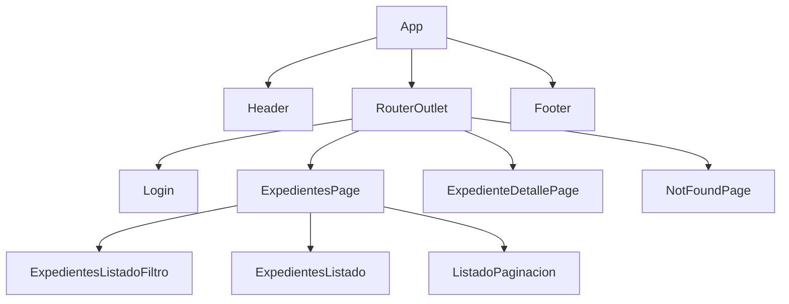
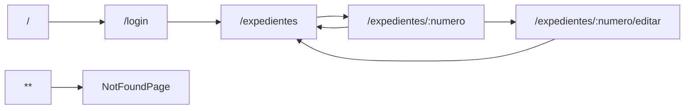

# Estructura de la aplicacion

Este documento explica qué contiene la aplicación desde el punto de vista de usuario y de interfaz.

## Layout general

El componente raíz `App` define el marco comun:

```html
<div class="app">
  <app-header />
  <main>
    <router-outlet />
  </main>
  <app-footer />
</div>
```

`Header` y `Footer` viven en `src/app/core`. El contenido central cambia según la ruta activa mediante `RouterOutlet`.

## Páginas existentes

| Página                 | Ruta                          | Funcion                                                              | Componentes principales                                                                  |
| ---------------------- | ----------------------------- | -------------------------------------------------------------------- | ---------------------------------------------------------------------------------------- |
| Login                  | `/login`                      | Permite introducir usuario y contraseña y navegar a expedientes.     | `Login`                                                                                  |
| Listado de expedientes | `/expedientes`                | Muestra filtros, estado de carga, tabla de expedientes y paginación. | `ExpedientesPage`, `ExpedientesListadoFiltro`, `ExpedientesListado`, `ListadoPaginacion` |
| Detalle de expediente  | `/expedientes/:numero`        | Muestra datos de un expediente si existe en el mock.                 | `ExpedienteDetallePage`                                                                  |
| Edición de expediente  | `/expedientes/:numero/editar` | Reutiliza la página de detalle en modo edición.                      | `ExpedienteDetallePage`                                                                  |
| Página no encontrada   | cualquier ruta no declarada   | Informa de que la ruta no existe y permite volver al inicio.         | `NotFoundPage`                                                                           |

## Componentes existentes

- `App`: layout raiz.
- `Header`: cabecera común con enlaces de navegación.
- `Footer`: pie común.
- `NotFoundPage`: página 404.
- `Login`: formulario de inicio de sesión.
- `ExpedientesPage`: página coordinadora del listado.
- `ExpedientesListadoFiltro`: formulario de filtros.
- `ExpedientesListado`: tabla de resultados.
- `ExpedienteDetallePage`: consulta y edición de un expediente.
- `ListadoPaginacion`: paginación reutilizable.

## Composición de componentes



## Navegación y rutas



La ruta raíz redirige a `login`. La ruta `expedientes` carga de forma diferida las rutas de la feature de expedientes. Cualquier ruta no reconocida termina en `NotFoundPage`.

## Mapa de componentes de expedientes

`ExpedientesPage` es la página contenedora. Recibe filtros desde la URL mediante `input()`, carga datos con `rxResource()` y reparte datos o acciones a sus hijos:

- `ExpedientesListadoFiltro` recibe `estados` y `prioridades`, y emite `filtrosAplicados`.
- `ExpedientesListado` recibe `expedientes` y emite `expedienteSeleccionado`.
- `ListadoPaginacion` recibe `itemsPorPagina`, `totalItems` e `itemsPrevios`, y emite `cambioPagina`.

Cuando el usuario selecciona un expediente en la tabla, `ExpedientesPage` navega a `/expedientes/:numero`. La página de detalle permite volver al listado o entrar en modo edición.
