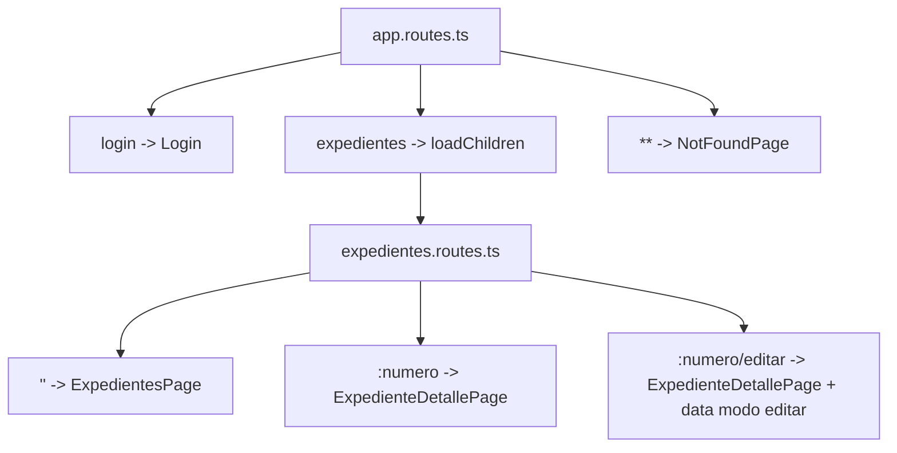

# Routing

El routing principal está en `src/app/app.routes.ts` y las rutas de expedientes están en `src/app/features/expedientes/expedientes.routes.ts`.

## Configuracion global

`app.config.ts` registra el router con `withComponentInputBinding()`:

```ts
provideRouter(routes, withComponentInputBinding());
```

Gracias a esto, parámetros de ruta, query params y `data` pueden llegar como `input()` a los componentes asociados a rutas.

## Rutas principales

```ts
export const routes: Routes = [
  { path: '', redirectTo: 'login', pathMatch: 'full' },
  { path: 'login', component: Login },
  {
    path: 'expedientes',
    loadChildren: () => import('./features/expedientes/expedientes.routes').then((m) => m.routes),
    canActivate: [authGuard],
  },
  { path: '**', component: NotFoundPage },
];
```

## Rutas de expedientes

```ts
export const routes: Routes = [
  { path: '', component: ExpedientesPage },
  {
    path: ':numero',
    component: ExpedienteDetallePage,
    canActivate: [rolGuard],
  },
  {
    path: ':numero/editar',
    component: ExpedienteDetallePage,
    canActivate: [rolGuard],
    data: { modo: 'editar' },
  },
];
```

## Parámetros de ruta

La ruta `/expedientes/:numero` pasa el número al detalle:

```ts
numero = input('');
```

La ruta `/expedientes/:numero/editar` reutiliza el mismo componente y aporta `data: { modo: 'editar' }`:

```ts
modo = input<'consulta' | 'editar'>('consulta');
esEdicion = computed(() => this.modo() === 'editar');
```

## Query params

Los filtros y la página se guardan como query params en `ExpedientesPage`:

```ts
this.router.navigate(['/expedientes'], {
  queryParams: {
    numero: filtros?.numero || null,
    estado: filtros?.estado || null,
    prioridad: filtros?.prioridad || null,
    fechaInicio: filtros?.fechaInicio || null,
    fechaFin: filtros?.fechaFin || null,
    numeroPagina: null,
  },
});
```

Cuando cambia la página, se conservan los filtros actuales y se actualiza `numeroPagina`.

## Navegacion y autorización

La feature de expedientes requiere una sesión mediante `authGuard`. Dentro de ella, el listado está disponible para lectores y editores; las rutas de detalle y edición requieren `rolGuard`, que solo permite el rol `EDITOR`.

Tras iniciar sesión, el login recupera la ruta almacenada por el interceptor en `returnUrl`. Si no existe una ruta interna válida, usa `/expedientes`:

```ts
const returnUrl = this.route.snapshot.queryParamMap.get('returnUrl');
const destino = returnUrl?.startsWith('/') && !returnUrl.startsWith('//')
  ? returnUrl
  : '/expedientes';

await this.router.navigateByUrl(destino);
```

El listado abre el detalle:

```ts
seleccionarExpediente(expediente: Expediente): void {
  this.router.navigate(['/expedientes', expediente.numero]);
}
```

El detalle entra en edición:

```ts
this.router.navigate(['/expedientes', this.expediente().numero, 'editar']);
```

Y `volver()` navega de vuelta a `/expedientes`.

## Relacion entre routing y páginas


