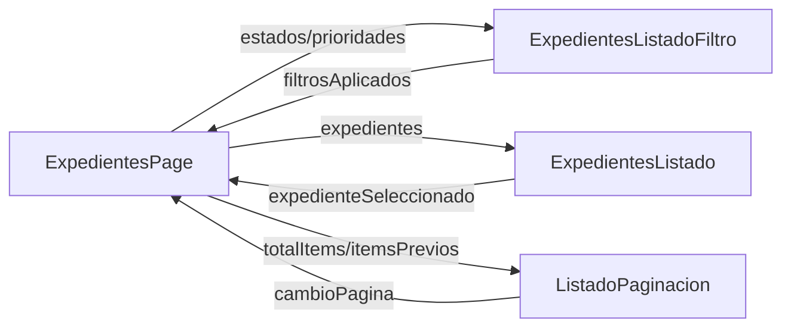

# Componentes y bindings

Angular conecta clases TypeScript y plantillas HTML mediante bindings. Este proyecto usa interpolación, property binding, event binding, two-way binding, inputs y outputs.

## Interpolacion

La interpolación muestra valores en la plantilla.

En `expedientes-listado.html`:

```html
{{ expediente.numero }} {{ expediente.titulo }} {{ expediente.estado }} {{ expediente.prioridad }}
{{ expediente.fechaAlta }}
```

En `listado-paginacion.html`:

```html
Pagina {{ paginaActual() }} de {{ totalPaginas() }}
```

Cuando el valor procede de un signal o computed, se lee invocandolo como funcion: `paginaActual()`.

## Property binding

El property binding pasa valores del componente padre al hijo o a una propiedad HTML.

En `expedientes-page.html`:

```html
<app-expedientes-listado
  [expedientes]="expedientes()"
  (expedienteSeleccionado)="seleccionarExpediente($event)"
>
</app-expedientes-listado>
```

También se usa para deshabilitar botones:

```html
<button [disabled]="loginForm().invalid()">Iniciar sesión</button>
```

## Binding de clases

El listado aplica clases según el estado del expediente:

```html
<span
  class="badge estado"
  [class.pendiente]="expediente.estado === 'pendiente'"
  [class.tramite]="expediente.estado === 'tramite'"
  [class.finalizado]="expediente.estado === 'finalizado'"
  [class.archivado]="expediente.estado === 'archivado'"
>
  {{ expediente.estado }}
</span>
```

La prioridad usa el mismo patron con `alta`, `media` y `baja`.

## Event binding

El event binding escucha eventos.

En el listado:

```html
<button type="button" class="edit-button" (click)="seleccionar(expediente)">Consultar</button>
```

El método del componente emite el expediente seleccionado:

```ts
seleccionar(expediente: Expediente): void {
  this.expedienteSeleccionado.emit(expediente);
}
```

## Two-way binding

El formulario de filtros usa `[(ngModel)]`:

```html
<input name="numero" type="search" [(ngModel)]="filtro.numero" />
<select name="estado" [(ngModel)]="filtro.estado"></select>
```

Este binding sincroniza campo y propiedad: la UI actualiza `filtro`, y `filtro` actualiza la UI.

## `input()`

`ExpedientesListadoFiltro` recibe listas desde su padre:

```ts
estados = input<EstadoExpediente[]>([]);
prioridades = input<PrioridadExpediente[]>([]);
```

La plantilla padre las enlaza asi:

```html
<app-expedientes-listado-filtro [estados]="estados" [prioridades]="prioridades">
</app-expedientes-listado-filtro>
```

## `@Input()`

`ExpedientesListado` usa `@Input()` clásico para recibir expedientes:

```ts
@Input() expedientes: Expediente[] = [];
```

El proyecto mezcla `@Input()` clásico en este componente con `input()` moderno en otros componentes.

## `output()`

Los hijos avisan al padre con `output()`.

Filtros:

```ts
filtrosAplicados = output<FiltrosExpediente | null>();
```

Paginacion:

```ts
cambioPagina = output<number>();
```

Listado:

```ts
expedienteSeleccionado = output<Expediente>();
```

## Comunicacion padre/hijo



`ExpedientesPage` coordina el estado y la navegación. Los hijos se centran en recoger datos de usuario o pintar información.
