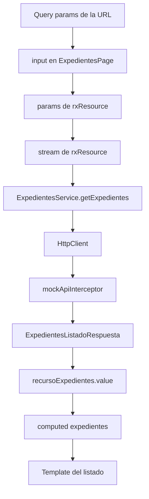

# Signals y rxResource

El listado de expedientes es el mejor ejemplo del proyecto para entender signals y `rxResource`.

## Signals de entrada

`ExpedientesPage` recibe filtros desde query params mediante `input()`:

```ts
numero = input('');
estado = input<EstadoExpediente | ''>('');
prioridad = input<PrioridadExpediente | ''>('');
fechaInicio = input('');
fechaFin = input('');
numeroPagina = input<number | string>();
```

Estos inputs cambian cuando cambia la URL.

## `rxResource`

`rxResource()` observa esos inputs en `params`:

```ts
protected recursoExpedientes = rxResource({
  params: () => ({
    numero: this.numero(),
    estado: this.estado(),
    prioridad: this.prioridad(),
    fechaInicio: this.fechaInicio(),
    fechaFin: this.fechaFin(),
    numeroPagina: this.numeroPagina(),
  }),
  stream: ({ params }) =>
    this.expedientesService.getExpedientes(...),
});
```

Cuando algún parámetro cambia, `rxResource` vuelve a ejecutar `stream`. El `stream` devuelve el `Observable` producido por `HttpClient`.

## Valor de respuesta

La respuesta se expone asi:

```ts
protected respuestaExpedientes = this.recursoExpedientes.value;
```

`respuestaExpedientes()` puede estar vacio antes de resolver la carga. Por eso el listado se deriva de forma segura:

```ts
protected expedientes = computed<Expediente[]>(() => {
  return this.respuestaExpedientes()?.data ?? [];
});
```

## Estado de carga

La plantilla pregunta a `rxResource`:

```html
@if (recursoExpedientes.isLoading()) {
<section class="estado-carga" aria-live="polite">Cargando expedientes...</section>
} @else { ... }
```

## Signals en paginación

`ListadoPaginacion` usa `input.required()` y `computed()`:

```ts
paginaActual = computed(() => {
  return Math.floor(this.itemsPrevios() / this.itemsPorPagina()) + 1;
});

totalPaginas = computed(() => {
  const total = Math.ceil(this.totalItems() / this.itemsPorPagina());
  return Math.max(total, 1);
});
```

## Signals en detalle

`ExpedienteDetallePage` usa `computed()` para buscar el expediente actual:

```ts
expediente: Signal<Expediente> = computed(() => {
  const numero = this.numero();
  return EXPEDIENTES_MOCK.find((expediente) => expediente.numero === numero) || ...
});
```

Y `effect()` para sincronizar el modelo de edición cuando hay expediente:

```ts
effect(() => {
  const expediente = this.expediente();
  if (expediente.numero) {
    this.modeloEdicion.set(this.aFormulario(expediente));
  }
});
```

## Flujo real de datos del listado


