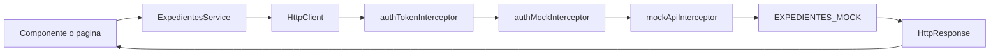

# HTTP y API mock

La aplicación simula una API HTTP sin backend real. El servicio hace llamadas con `HttpClient` y el interceptor responde desde memoria.

## Configuracion de HttpClient

`app.config.ts` registra `HttpClient` y tres interceptores:

```ts
provideHttpClient(withInterceptors([
  authTokenInterceptor,
  authMockInterceptor,
  mockApiInterceptor,
]));
```

## Servicio

`ExpedientesService` vive en `src/app/features/expedientes/services/expedientes-service.ts`.

```ts
@Service()
export class ExpedientesService {
  private readonly httpClient = inject(HttpClient);
}
```

## Endpoints usados o soportados

| Metodo | URL                        | Donde se define        | Uso real en la app                                               |
| ------ | -------------------------- | ---------------------- | ---------------------------------------------------------------- |
| `GET`  | `/api/expedientes`         | Servicio e interceptor | Usado por el listado con filtros y paginacion.                   |
| `GET`  | `/api/expedientes/:numero` | Servicio e interceptor | Soportado, pero la página de detalle actual lee el mock directo. |
| `PUT`  | `/api/expedientes/:numero` | Servicio e interceptor | Usado al guardar la edición.                                     |
| `POST` | `/api/auth/login` | AuthService e interceptor | Autentica y devuelve token, usuario y rol. |
| `GET` | `/api/auth/perfil` | Interceptor de autenticación | Devuelve el perfil de la sesión mock. |

## HttpParams

`getExpedientes` construye query params solo cuando hay filtros:

```ts
let params = new HttpParams();

if (filtros.numero) {
  params = params.set('numero', filtros.numero);
}

params = params.set('skip', String(skip));
params = params.set('limit', String(limit));
```

Los parámetros soportados son:

- `numero`
- `estado`
- `prioridad`
- `fechaInicio`
- `fechaFin`
- `skip`
- `limit`

## Interceptores

`authTokenInterceptor` añade `Authorization: Bearer <token>` a las peticiones. Si recibe un `401`, elimina la sesión y redirige a `/login` con el query param `returnUrl`.

`authMockInterceptor` simula las cuentas, la emisión de tokens y la autorización por roles. Puede devolver:

- `401`: credenciales incorrectas, token ausente o sesión caducada.
- `403`: sesión válida, pero el rol no tiene permiso para la operación.

`mockApiInterceptor` intercepta:

- `GET /api/expedientes`: filtra y página `EXPEDIENTES_MOCK`.
- `GET /api/expedientes/:numero`: busca un expediente por numero.
- `PUT /api/expedientes/:numero`: actualiza el expediente en el array mock.

Si la petición no coincide, llama a `next(req)`.

## Datos mock

`EXPEDIENTES_MOCK` contiene expedientes con esta forma:

```ts
{
  numero: 'EXP-2026-0001',
  titulo: 'Solicitud de licencia de actividad 1',
  estado: 'tramite',
  prioridad: 'alta',
  fechaAlta: '2026-08-12',
}
```

## Diferencias entre listado, detalle y edición

- Listado: usa `ExpedientesService.getExpedientes`, `HttpClient`, interceptor y respuesta paginada.
- Detalle: `ExpedienteDetallePage` busca directamente en `EXPEDIENTES_MOCK` mediante `computed()`.
- Edición: carga el modelo desde el expediente encontrado en memoria y guarda con `ExpedientesService.actualizarExpediente`, que termina en `PUT /api/expedientes/:numero`.

## Flujo HTTP


