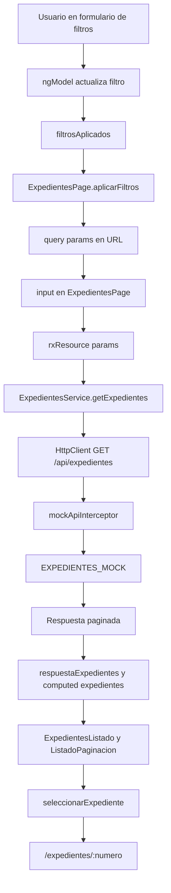

# Flujo del listado

Este documento sigue el recorrido real del código cuando el usuario trabaja con el listado de expedientes.

## 1. El usuario entra al listado

La navegación llega a `/expedientes`. Esa ruta pertenece a `features/expedientes/expedientes.routes.ts`:

```ts
{ path: '', component: ExpedientesPage }
```

`ExpedientesPage` renderiza:

- `ExpedientesListadoFiltro`
- mensaje de carga si `recursoExpedientes.isLoading()`
- `ExpedientesListado`
- `ListadoPaginacion`

Al entrar sin query params, los `input()` de filtros tienen valores vacíos.

## 2. `rxResource` prepara la consulta

`rxResource` lee los inputs:

```ts
params: () => ({
  numero: this.numero(),
  estado: this.estado(),
  prioridad: this.prioridad(),
  fechaInicio: this.fechaInicio(),
  fechaFin: this.fechaFin(),
  numeroPagina: this.numeroPagina(),
});
```

Después llama al servicio:

```ts
this.expedientesService.getExpedientes(
  {
    numero: params.numero,
    estado: params.estado,
    prioridad: params.prioridad,
    fechaInicio: params.fechaInicio,
    fechaFin: params.fechaFin,
  },
  (this.normalizarNumeroPagina(params.numeroPagina) - 1) * this.resultadosPorPagina,
  this.resultadosPorPagina,
);
```

`resultadosPorPagina` vale `5`.

## 3. El servicio construye la peticion

`ExpedientesService.getExpedientes` crea `HttpParams` con filtros, `skip` y `limit`, y hace:

```ts
return this.httpClient.get<ExpedientesListadoRespuesta>('/api/expedientes', {
  params,
});
```

## 4. El interceptor responde

`mockApiInterceptor` detecta `GET /api/expedientes`, lee los parámetros, filtra `EXPEDIENTES_MOCK`, aplica paginación con `slice` y devuelve:

```ts
{
  data,
  total: expedientes.length,
  skip: skipNormalizado,
  limit: limitNormalizado,
}
```

## 5. La respuesta vuelve al template

`rxResource` guarda la respuesta en `value`:

```ts
protected respuestaExpedientes = this.recursoExpedientes.value;
```

El listado visible se obtiene con:

```ts
protected expedientes = computed<Expediente[]>(() => {
  return this.respuestaExpedientes()?.data ?? [];
});
```

La plantilla pasa datos a los hijos:

```html
<app-expedientes-listado [expedientes]="expedientes()" />

<app-listado-paginacion
  [itemsPorPagina]="resultadosPorPagina"
  [totalItems]="respuestaExpedientes()?.total ?? 0"
  [itemsPrevios]="respuestaExpedientes()?.skip ?? 0"
>
</app-listado-paginacion>
```

## 6. El usuario aplica filtros

El usuario rellena campos en `ExpedientesListadoFiltro`. Cada campo actualiza `filtro` con `[(ngModel)]`.

Al pulsar buscar:

```ts
buscar(): void {
  this.filtrosAplicados.emit({
    ...this.filtro,
    fechaInicio: this.aFechaIso(this.fechaInicio),
    fechaFin: this.aFechaIso(this.fechaFin),
  });
}
```

`ExpedientesPage.aplicarFiltros` recibe el evento y navega a `/expedientes` con query params:

```ts
queryParams: {
  numero: filtros?.numero || null,
  estado: filtros?.estado || null,
  prioridad: filtros?.prioridad || null,
  fechaInicio: filtros?.fechaInicio || null,
  fechaFin: filtros?.fechaFin || null,
  numeroPagina: null,
}
```

Al cambiar la URL, cambian los `input()` de `ExpedientesPage`, se recalculan los parámetros de `rxResource` y se relanza la carga.

## 7. El usuario cambia de pagina

`ListadoPaginacion` calcula la pagina actual:

```ts
paginaActual = computed(() => {
  return Math.floor(this.itemsPrevios() / this.itemsPorPagina()) + 1;
});
```

Al hacer click en el paginador de Material:

```html
<mat-paginator
  [pageIndex]="paginaActual() - 1"
  [pageSize]="itemsPorPagina()"
  (page)="navegarAPagina($event)">
</mat-paginator>
```

El componente emite:

```ts
this.cambioPagina.emit(evento.pageIndex + 1);
```

`ExpedientesPage.cambioPagina` actualiza `numeroPagina` en query params y conserva los filtros actuales.

## 8. El usuario abre un expediente

En la tabla:

```html
<button type="button" (click)="seleccionar(expediente)">Consultar</button>
```

`ExpedientesListado` emite el expediente, y `ExpedientesPage` navega:

```ts
this.router.navigate(['/expedientes', expediente.numero]);
```

La ruta activa pasa a `/expedientes/:numero` y se muestra `ExpedienteDetallePage`.

## Diagrama completo


